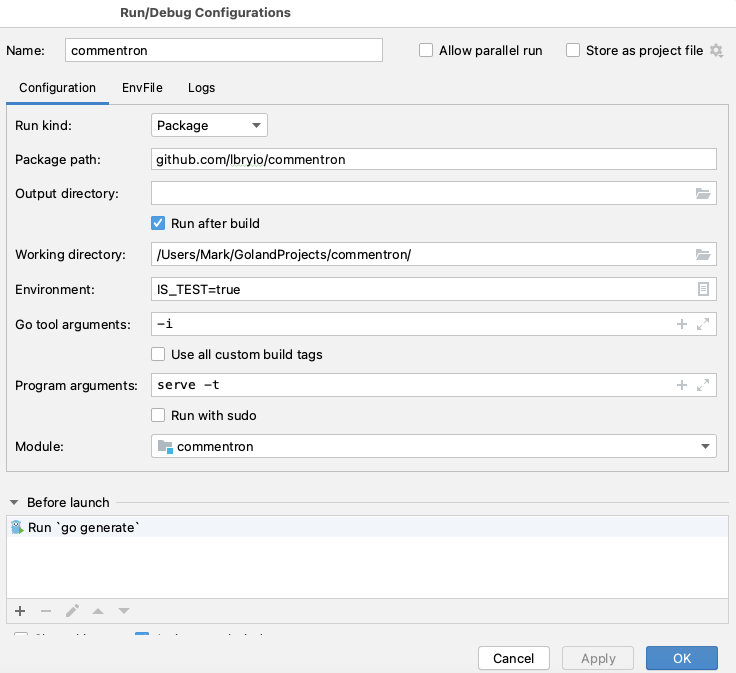

# Commentron 

This is the commenting system for odysee.com. The system uses a JSON RPC server.
 
## Run it locally

### Goland



Make sure you setup the configuration to use env files. 

`MYSQL_DSN_RO="lbry-ro:lbry@tcp(localhost:3306)/commentron"`

`MYSQL_DSN_RW="lbry-rw:lbry@tcp(localhost:3306)/commentron"`

`SDK_URL="https://api.na-backend.odysee.com/api/v1/proxy"`

`SOCKETY_TOKEN="sockety_token" #If you want to integrate directly with sockety locally`

I put the `IS_TEST=true` in the configuration but it could be in the `.env` file. 

### MySQL 5.7

Install MySQL 5.7 and create a database named `commentron` then adjust the DSN
in the `.env` file locally with the username and password. 

Then once mysql is running you can hit play. 

## Key packages

These are the key packages where most work is completed.

`commentapi` -  This contains all the client API information 

`server/service` - Contains all the API implementations

`migration` - Contains the migrations to the database

`http_requests` - This has http requests for testing different APIs. Best used as templates

## Documentation, Integration & Examples

### Documentation

Please refer to the [client API](commentapi) for documentation. Things that are not clear from the name are documented there.
We are still improving them, and what may seem obvious to me, might not be to others. Please feel free
to create issues to elaborate on anything seen in there that is unclear. More comments will be added. 

### Examples

As part of testing locally we leverage completely independent [HTTP Tests](http_requests). You will see
groups for both local testing and production. This contains all the information for you to create your 
own curl requests against the server. Together with the client api documentation, it should be relatively
easy to find your way around. Again if it is not, and something specific is not clear please create an issue
and additional documentation will be provided. 

### Integration 

The only integration we really support right now, is via the [Go Client API](commentapi). 

```golang
package main

import "github.com/lbryio/commentron/commentapi"

func main() {
	commentID := "0fa2eacf0b91fa3187e87733f103418e51f0c40d0b06b67c5d6d3ff2c13b2925"
	resp, err := commentapi.NewClient("https://comments.odysee.com/api").CommentByID(commentapi.ByIDArgs{CommentID: commentID})
	if err != nil {
		panic(err)
	}
	println(resp.Item.Comment)
	println(resp.Item.ClaimID)
	println(resp.Item.Timestamp)
}
```

You can check out our own example above on the [Go playground](https://play.golang.com/p/o2gHKgvamu3)


#### Contributor Examples

Feel free to create examples like the above on the Go Playground and create a PR to add the link here below.

Use the markdown formatting [title] (url) when contributing examples below and start them with a new bullet:

-  . . .
-  . . .


